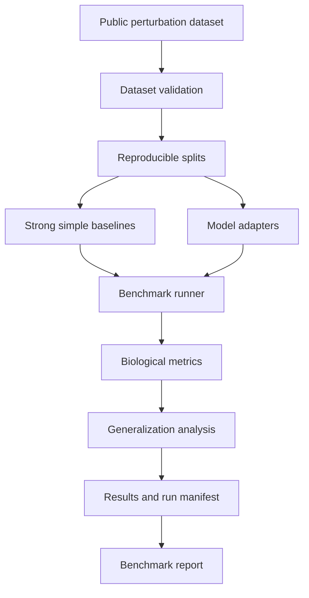

# CellForge

**A reproducible benchmarking harness for virtual-cell and single-cell perturbation models.**

Current status: **Stage 1 — architecture and repository foundation**. This repository contains documentation, project metadata, and reserved directories. Dataset ingestion, models, metrics, CLI commands, and benchmark execution are not implemented. No benchmark results are available.

## Why CellForge?

Biological foundation models aim to learn meaningful representations of cellular state. Such representations can inform perturbation prediction, virtual-cell modeling, and cellular response modeling, but representation quality alone does not establish predictive generalization.

Benchmark conclusions depend on dataset construction, train/test leakage, donor and cell-type overlap, perturbation overlap, preprocessing, and metric selection. A model may appear strong on a random cell split while failing on unseen biology. CellForge is designed to make these evaluation choices explicit and reproducible.

## Core Research Question

> Do modern biological foundation and perturbation-response models predict cellular state under unseen perturbations and biological contexts better than strong simple baselines?

## What CellForge Does

The planned harness will provide dataset validation, reproducible biological splits, model adapters, strong simple baselines, standardized benchmark execution, biological metrics, and OOD/generalization analysis. Future runs will preserve run manifests and machine-readable results for comparison reports. These are planned capabilities, not currently available functionality.

## Core Architecture



This diagram describes the intended architecture. See [architecture](docs/architecture.md) for responsibilities and boundaries.

## Why Generalization Matters

Random holdout accuracy is a useful reference but can reward familiarity with donors, perturbations, or cellular states shared with training data.

- **Seen-context evaluation:** a standard reference within represented biological conditions.
- **Unseen perturbation:** prediction for a perturbation excluded from training and model selection.
- **Unseen donor:** transfer across individuals, where donor metadata and experimental replication support it.
- **Unseen cell type:** transfer of responses across cellular identities.
- **Unseen context:** transfer under another explicitly defined biological shift.

These are candidate evaluation conditions. No dataset has been selected, and no condition is currently supported. Dataset inspection must establish which holdouts are identifiable and meaningful; confounded or missing metadata cannot justify OOD claims.

## Initial Scope

The planned MVP starts with one public perturbation dataset, an immune-cell focus where feasible, and one prediction task. It will establish one dataset adapter, deterministic preprocessing, reproducible train/validation/test splits, unseen-perturbation evaluation, and at least one additional OOD evaluation if genuinely supported. Strong simple baselines will precede one appropriate advanced perturbation model. Standardized metrics, machine-readable results, and reproducible reports complete the intended MVP.

If the selected dataset cannot support an additional biological holdout, the limitation will be documented and scope revisited before claiming broader generalization. Stage 1 only establishes the repository foundation.

## Models

A common adapter layer will isolate model-specific preparation, fitting/loading, prediction, and metadata. GEARS, scGPT, Geneformer, and STATE are candidate families for later suitability assessment, not installed integrations or promised task support.

**Inclusion in CellForge does not imply that every model is directly designed for every perturbation-prediction task.** Each integration must demonstrate compatible inputs, outputs, perturbation semantics, and inference conditions. Representation encoders require a justified prediction mechanism before being compared as perturbation predictors.

## Baselines Matter

Simple baselines are first-class participants. Candidate methods include a control-state predictor, training-derived mean responses, linear models, nearest neighbors, and a simple neural baseline where justified. The final set depends on the dataset and task, particularly what information is available for unseen perturbations.

A sophisticated model should demonstrate measurable improvement over meaningful simple methods under the same evaluation contract. Baselines must receive reasonable tuning and cannot use held-out response information. Neither model superiority nor a particular winner is assumed; null and negative findings are valid.

## Evaluation Metrics

| Family | Planned measurements | Purpose |
| --- | --- | --- |
| Expression agreement | Pearson, Spearman, MSE, MAE | Assess pattern and magnitude agreement on a declared expression scale |
| Differential-expression recovery | Top-k DEG overlap, DEG precision/recall, direction-of-effect agreement, response-gene recovery | Assess recovery of perturbation effects relative to controls |
| Perturbation-level evaluation | Perturbation ranking, response magnitude agreement | Compare responses across interventions |
| Generalization | Separate metrics for seen conditions, unseen perturbations, donors, cell types, and supported contexts | Reveal where performance transfers or fails |

No single aggregate score will define model quality. Definitions, aggregation units, and limitations must accompany results. See [planned metrics](docs/metrics.md).

## Reproducibility

Future runs will retain fixed seeds, dataset versions and fingerprints, preprocessing fingerprints, split manifests, model and adapter identifiers, checkpoint hashes where possible, inference settings, metric settings, configuration snapshots, environment information, timestamps, and run IDs. Raw predictions and standardized derived metrics will be traceable through result artifacts.

Cached preprocessing will be keyed by data and configuration fingerprints, including split-dependent fitted transformations. A stale cache must never silently substitute for a requested transformation. See the [future reproducibility contract](docs/reproducibility.md); no manifest or cache is implemented yet.

## Example Benchmark Run

Conceptual example only; this is not an executable command or a completed experiment:

```text
Dataset:     One public single-cell perturbation dataset, to be selected
Task:        Predict post-perturbation gene expression
Split:       Unseen perturbation
Models:      Strong simple baseline vs appropriate perturbation model
Evaluation:  Expression agreement, DEG recovery, direction-of-effect accuracy
Outputs:     Predictions, metrics, run manifest, comparison report
```

## Technology Direction

The current repository targets Python 3.10+ with minimal package metadata and no runtime dependencies, executable CLI, or scientific implementation.

The planned scientific stack may use AnnData/Scanpy, NumPy, pandas or Polars, SciPy, scikit-learn, PyTorch, and model-specific libraries as needed. Dependencies will be added when actual integrations justify them.

Engineering direction includes typed Python, a Typer CLI, typed experiment configuration, deterministic seeds, cached preprocessing, run manifests, machine-readable results, and automated reporting. Conceptual future operations include validation, preparation, benchmarking, comparison, and reporting; none are available commands today.

## Repository Structure

- `src/cellforge/validation/`: reserved for structural and biological dataset checks.
- `src/cellforge/tasks/`: reserved for prediction contracts and, initially, task-specific split responsibilities.
- `src/cellforge/models/`: reserved for adapters that isolate external model dependencies.
- `src/cellforge/baselines/`: reserved for simple methods using the same task and evaluation contract.
- `src/cellforge/metrics/`: reserved for metric definitions and computations.
- `src/cellforge/reports/`: reserved for reporting logic; root `reports/` will hold report artifacts.
- `configs/`: guidance for future typed experiment configuration, without fake runnable examples.
- `data/`: data-management policy; datasets and caches are excluded from source control.
- `experiments/`: run organization and provenance policy.
- `docs/`: architecture, benchmark design, metric rationale, and reproducibility contracts.
- `tests/unit/` and `tests/integration/`: reserved for future meaningful checks; no benchmark tests exist yet.

Empty directories are reserved with `.gitkeep`; they contain no Python implementation modules. Dataset and runner modules will be introduced only when needed.

## Current Status

**Stage 1 — architecture and repository foundation** establishes project scope, architecture, benchmark principles, reproducibility expectations, documentation, and repository organization. No scientific computation or measured benchmark findings are included.

## Roadmap

The [phased roadmap](ROADMAP.md) proceeds from dataset validation and reproducible splits to baselines, a model adapter, one advanced model, biological metrics, a local runner, generalization experiments, artifact hardening, and reports. Benchmark before scaling: one dataset, one task, strong baselines, one advanced model, and good evaluation come first.

## Non-Goals

CellForge is not a new virtual-cell foundation model, an autonomous scientist, a multi-agent system, a generic RAG application, a chatbot, an MCP server, a workflow orchestration platform, a GPU framework, or a clinical decision system. It is also not a generic backend service platform. The core benchmark does not require an LLM.

The primary contribution is **rigorous and reproducible evaluation infrastructure for single-cell perturbation models**. Generalization, biological evaluation, and scientific honesty take precedence over leaderboard chasing. Unnecessary APIs, databases, queues, cloud infrastructure, and distributed orchestration are outside the initial scope.

## License

[MIT License](LICENSE).
