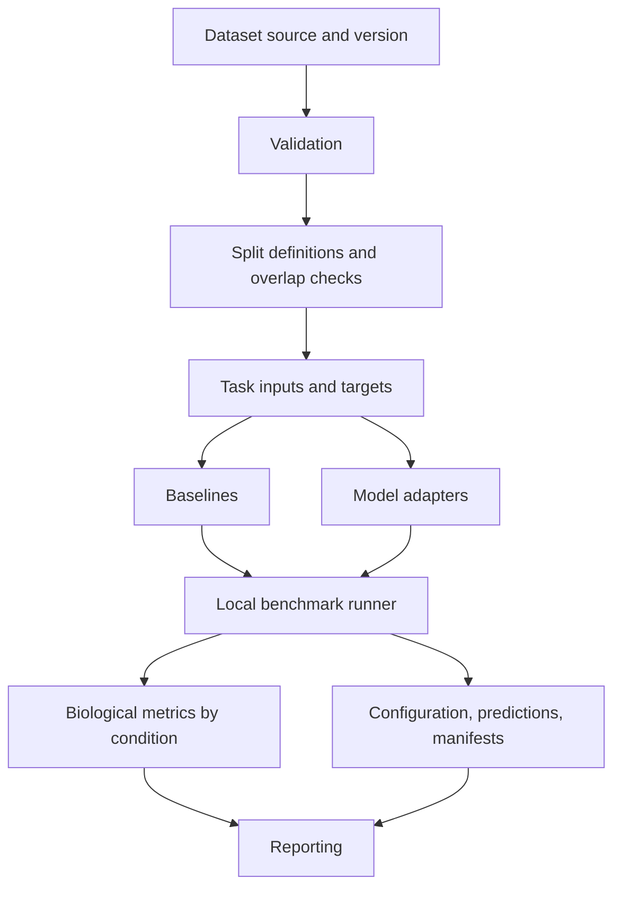

# Planned architecture

Stage 1 documents boundaries only. No component described below is implemented.

## Dataset layer

Register one source initially, recording provenance, access conditions, source metadata, version, and fingerprints. Preserve stable cell and gene identifiers and document the meaning of measurements. Dataset selection belongs to Phase 1; donor, cell-type, and context support remain unverified. Introduce a dedicated dataset module only with real ingestion requirements.

## Validation layer

Check schema, identifier uniqueness, matrix/metadata alignment, expected biological metadata, perturbation labels, control definitions, missingness, and usable expression values. Distinguish invalid data from documented limitations. Validation must identify confounding and absent metadata rather than manufacture biological annotations.

## Split layer

Define deterministic reference and OOD partitions with persisted membership, distributions, and overlap checks. Holdout units follow the biological question, not merely cell rows. Fit learned preprocessing on training data only. Task-specific split work can initially live with tasks; a separate namespace is justified when responsibilities grow.

## Task layer

Specify the prediction target, expression scale, gene universe, aggregation unit, admissible conditioning variables, control policy, and cell/condition identifiers. Normalize inputs and outputs without implying paired pre/post measurements exist. Observed test responses belong exclusively to evaluation. Define whether target-context controls are admissible before running comparisons.

## Model adapter layer

Isolate external dependencies, model-specific preparation, fitting/loading, and prediction. Normalize outputs against task identifiers and expose model, checkpoint, adapter, and inference metadata. Candidate concepts are prepare, fit/load, predict, and metadata; no API signatures are finalized. Reject unsupported tasks or output mismatches rather than silently filling missing genes. Assess pretraining exposure and external information explicitly.

## Baseline layer

Provide strong comparison methods with the same inputs, splits, and evaluation contract as advanced models. Learn response statistics and tune hyperparameters without test targets. Unseen-perturbation methods need a declared strategy for perturbations absent from training. Baselines are mandatory before claims about advanced models.

## Benchmark runner

A future local runner will combine dataset, task, split, model, configuration, seed, and metrics. Preserve resolved configuration and produce predictions, logs, manifests, and artifacts. Record failures and partial runs explicitly. Basic reproducibility is required from the first runnable benchmark; later phases harden it. No service infrastructure or general workflow engine is needed.

## Metrics layer

Provide deterministic, documented biological evaluation on aligned predictions and observations. Record expression scale, controls, gene selection, grouping, undefined cases, and aggregation. Break performance down by perturbation and supported biological shifts. See [metrics](metrics.md).

## Reporting layer

Consume persisted machine-readable results and provenance instead of rerunning models. Produce human-readable comparisons, uncertainty where justified, subgroup performance, and failure cases. Root `reports/` contains generated outputs; `src/cellforge/reports/` is reserved for future reporting code.

## Configuration and artifact boundaries

Typed configuration and a future Typer CLI will expose the local harness when real operations exist. Cache keys must bind source data, preprocessing configuration, relevant split membership, fitted transformations, and software versions. Result records may conceptually include run ID, dataset, task, split, model, seed, metric, value, and metadata; this is not a finalized schema.

Keep the current six reserved package directories. Add datasets, splits, runner, or artifact modules when implementation demonstrates their need. Prefer one correct end-to-end comparison over speculative abstractions or many incomplete integrations.
